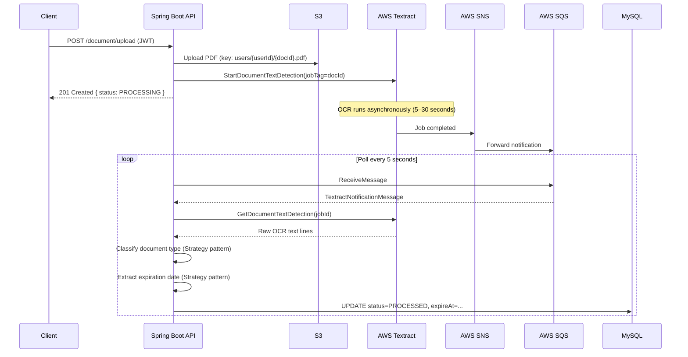

# DoSafe

A backend system that processes identity documents (DNI, passport, driver's license), extracts their expiration dates using AWS Textract OCR, and sends email alerts before they expire.

Built as a portfolio project to demonstrate production-grade backend engineering with Java and Spring Boot.

---

## The Problem

Most people don't track when their identity documents expire. DoSafe solves this: upload a photo or scan of your document, and the system extracts the expiration date automatically and sends you a reminder email 30 days before it expires.

---

## Tech Stack

| Layer | Technology |
|---|---|
| Framework | Spring Boot 4.0.2 / Spring 7 / Java 17 |
| Security | Spring Security + JWT (stateless) + Refresh Tokens |
| Database | MySQL 8.x + JPA/Hibernate + Flyway |
| Cloud — Storage | AWS S3 |
| Cloud — OCR | AWS Textract |
| Cloud — Messaging | AWS SQS + SNS |
| Cloud — Email | AWS SES |
| PDF processing | Apache PDFBox |
| Build | Maven |
| Boilerplate | Lombok |
| API Docs | SpringDoc OpenAPI (Swagger UI) |

---

## How It Works

### Upload flow (synchronous)

The HTTP request completes immediately — OCR runs in the background.

```
POST /document/upload
  → Convert image/PDF to standardized PDF (PDFBox)
  → Upload to S3  →  key: users/{userId}/{documentId}.pdf
  → Start Textract async job (jobTag carries documentId + correlationId)
  → Return 201 { documentId, status: PROCESSING }
```

### OCR processing flow (asynchronous)

A scheduler polls SQS every 5 seconds for Textract completion notifications.



### Alert flow (daily scheduled job)

```
@Scheduled(cron = "0 0 8 * * *")  — runs every day at 08:00
  → Find documents expiring within 30 days with no alert sent yet
  → Persist AlertModel records
  → Send emails via AWS SES (async — failed alerts are retried the next day)
```

---

## API Reference

All responses follow a consistent envelope format:

```json
{
  "data": { ... },
  "meta": {
    "success": true,
    "statusCode": 201,
    "message": "Resource created successfully!",
    "timestamp": "2025-06-01T12:00:00Z"
  }
}
```

Errors follow the same structure with an `error` field instead of `data`:

```json
{
  "error": { "code": "USER_ALREADY_EXISTS", "details": "Username 'john' is already taken" },
  "meta": { "success": false, "statusCode": 409, "message": "Conflict", "timestamp": "..." }
}
```

### Authentication

| Method | Path | Auth | Description |
|---|---|---|---|
| `POST` | `/authentication/register` | Public | Create a new account |
| `POST` | `/authentication/login` | Public | Returns JWT access token + refresh token |
| `GET` | `/authentication/verify-email` | Public | Confirm email address via token |
| `POST` | `/authentication/resend-verification` | Public | Re-send verification email |

### Documents

| Method | Path | Auth | Description |
|---|---|---|---|
| `POST` | `/document/upload` | Bearer JWT | Upload identity document (JPG, PNG, PDF) |

Interactive docs: `http://localhost:8080/swagger-ui.html`

---

## Design Decisions

### Async OCR via SQS — not polling Textract directly

Textract takes 5–30 seconds to process a document. Rather than blocking the HTTP request, the upload endpoint returns immediately with `status: PROCESSING`. A background scheduler polls SQS every 5 seconds for completion events.

This keeps upload latency low and decouples the user-facing API from OCR processing time.

### Strategy Pattern for expiration date extraction

Different document types encode dates differently — a DNI uses `DD MM YYYY`, a passport uses `YYMMDD` in the MRZ line. Each type gets its own `ExpirationDateExtractor` implementation, selected at runtime by `ExpirationDateExtractorSelector`.

Adding a new document type means adding one class. No existing code changes (Open/Closed Principle).

```
ExpirationDateExtractor          ← interface
├── IdentityCardDateExtractor    ← DNI format
├── PassportDateExtractor        ← MRZ format
└── OtherExpirationDateExtractor ← Null Object (returns empty Optional, never throws)
```

### Correlation ID for end-to-end tracing

Every HTTP request gets a UUID injected into the SLF4J MDC. It appears in every log line, travels as S3 object metadata, as Textract's `jobTag`, and is recovered when the SQS notification arrives. A single document can be traced across the full async pipeline with one ID.

```
[8f3a1c2d] DocumentUploadService       - Starting upload documentId=abc userId=42
[8f3a1c2d] S3DocumentStorage           - Upload finished documentId=abc
[8f3a1c2d] TextractQueueConsumer       - Processing result documentId=abc
[8f3a1c2d] ProcessTextractResultService - Processed expireAt=2027-06-30
```

### Sealed interface for API responses

`ApiResponse<T>` is a sealed interface with two permitted records: `Success<T>` and `Error`. Invalid states are unrepresentable by construction — there's no way to return a success response with error fields. Pattern matching on the type is exhaustive.

### Dependency Inversion in email sending

`AlertService` depends on `EmailService`, which depends on `EmailSender` (an interface). The concrete AWS SES implementation (`SesEmailSender`) is injected at runtime. The alert logic is completely isolated from the email provider — swapping SES for SendGrid or a test mock requires no changes to business logic.

---

## Running Locally

**Prerequisites:** Java 17, Maven, MySQL running on `localhost:3306`.

```bash
git clone https://github.com/miguel-damasco/DoSafe.git
cd DoSafe/dosafe-backend/DoSafe

# Required environment variables
export AWS_S3_BUCKET=dosafe-documents
export AWS_REGION=us-east-2
export AWS_ACCESS_KEY_ID=your_key
export AWS_SECRET_ACCESS_KEY=your_secret

mvn clean spring-boot:run
```

App starts on `http://localhost:8080`. The database schema is managed by Flyway — tables are created automatically on first run.

---

## Project Structure

```
src/main/java/com/miguel_damasco/DoSafe/
├── common/
│   ├── apiResponse/    # ApiResponse<T> sealed interface, ApiResponses factory
│   ├── correlationId/  # CorrelationIdHolder (MDC wrapper), CorrelationIdFilter
│   └── exception/      # DoSafeException hierarchy, GlobalExceptionHandler
├── config/             # Security, AWS, Async, Jackson, OpenAPI
├── document/
│   ├── controller/     # POST /document/upload
│   ├── service/        # DocumentUploadService, ProcessTextractResultService
│   ├── domain/
│   │   ├── classification/  # DocumentClassifier interface + GeneralDocumentClassifier
│   │   └── extraction/      # ExpirationDateExtractor (Strategy) + per-type implementations
│   └── infrastructure/
│       ├── conversion/      # PdfDocumentConverter (PDFBox)
│       └── ocr/             # TextractClientAdapter, SQS consumer, SNS DTOs
├── user/               # Registration, login, email verification, refresh tokens
├── security/           # JWT filter, CustomUserDetailsService
├── email/              # EmailSender interface, SesEmailSender
├── alert/              # AlertModel, AlertService (daily expiration check)
└── storage/            # DocumentStorage interface, S3DocumentStorage
```

---

## Roadmap

- [ ] Tests — unit and integration coverage
- [ ] Docker Compose — one-command local setup (app + MySQL)
- [ ] Deploy to AWS EC2
- [ ] Handle failed Textract jobs (currently stays `PROCESSING` indefinitely)
- [ ] Complete `PassportDateExtractor` implementation
- [ ] Frontend (React)
